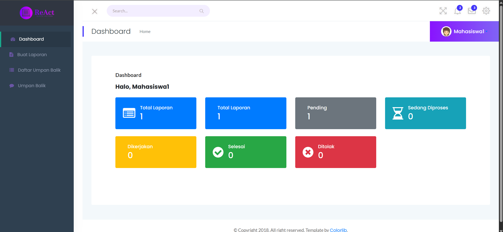

link : https://reportaction.dbsnetwork.my.id/ 

# 🏢 ReAct - Manajemen Fasilitas Kampus

**ReAct** (Report and Action) adalah sistem manajemen fasilitas Jurusan Teknologi Informasi berbasis web yang dirancang untuk memudahkan pengelolaan sarana dan prasarana, pelaporan kerusakan, penugasan teknisi, serta pelacakan status dan prioritas perbaikan.

---

## 🚀 Fitur Utama

* ✅ Autentikasi dan manajemen pengguna berdasarkan peran (admin, sarana-prasarana, teknisi, mahasiswa/dosen/tendik)
* 🧾 Pelaporan kerusakan fasilitas secara real-time
* 📌 Penentuan prioritas perbaikan berdasarkan bobot/kriteria tertentu
* 🛠️ Penugasan teknisi sesuai keahlian
* 📷 Upload foto bukti kerusakan
* 📊 Statistik dan riwayat perbaikan
* 📁 Ekspor data (PDF)
* 🔍 Filter dan pencarian cerdas (AJAX + DataTables)

---

## 🛠️ Teknologi yang Digunakan

* **Backend**: Laravel 10
* **Frontend**: Blade, SRTDash, jQuery, AJAX
* **Database**: MySQL
* **Library Tambahan**:

  * SweetAlert2
  * Select2
  * DataTables
  * DomPDF

---

## 📂 Struktur Modul

```
├── Auth (login, register, logout)
├── Dashboard (statistik umum)
├── Master Data
│   ├── Gedung, Lantai, Ruang
│   ├── Kategori barang & Sarana
│   └── User & Level Akses
├── Pelaporan Kerusakan
│   ├── Mahasiswa/Dosen/Tendik
│   └── Proses Validasi oleh Sarpras
├── Manajemen Perbaikan
│   ├── Prioritas oleh Sarpras
│   └── Eksekusi oleh Teknisi
├── Riwayat dan Statistik
├── Export/Import (Excel/PDF)
└── Umpan Balik
```

## 📸 Cuplikan Layar



---

## 🤝 Kontribusi

Pull request dan masukan sangat disambut! Silakan fork repository ini dan buat branch baru untuk fitur atau perbaikan Anda.

---

## 📄 Lisensi

MIT License © 2025 - Tim Pengembang ReAct

---

## 📋 Persyaratan Sistem

Pastikan environment Anda memenuhi persyaratan berikut:

* **PHP**: [Versi PHP, misal: >= 8.1]
* **Node.js**: [Versi Node.js, misal: >= 18.x]
* **Composer**: [Versi Composer, misal: >= 2.x]
* **Database**: MySQL / MariaDB

---

## 🛠️ Setup Awal (Development)

Langkah-langkah untuk menyiapkan proyek di environment lokal Anda untuk development sehari-hari:

1.  **Clone Repository:**
    ```bash
    git clone https://github.com/MRifdaM/ReAct-Testing.git
    cd [nama-direktori-proyek]
    ```

2.  **Install Dependencies:**
    ```bash
    composer install
    npm install
    ```

3.  **Setup File `.env`:**
    * Salin file .env.example:
        ```bash
        cp .env.example .env
        ```
    * Buka file `.env` dan **konfigurasikan koneksi database development**:
        ```ini
        DB_CONNECTION=mysql
        DB_HOST=127.0.0.1
        DB_PORT=3306
        DB_DATABASE=sarpras       # <-- Ganti nama database development Anda
        DB_USERNAME=root          # <-- Ganti username DB Anda
        DB_PASSWORD=              # <-- Ganti password DB Anda (kosongkan jika tidak ada)
        ```
    * Pastikan `APP_ENV=local` dan `APP_DEBUG=true`.

4.  **Generate Application Key:**
    ```bash
    php artisan key:generate
    ```

5.  **Siapkan Database Development:**
    * Buat database baru di MySQL/MariaDB sesuai nama yang masukkan di `.env` (misal, `sarpras`).
        ```sql
        -- Contoh SQL:
        CREATE DATABASE sarpras;
        ```
    * Jalankan migrasi dan seeder untuk membuat tabel dan mengisi data awal development:
        ```bash
        php artisan migrate --seed
        ```
        *(Jika menggunakan file SQL dump untuk development, impor file tersebut ke database `sarpras` sebagai gantinya)*

6.  **Jalankan Server Development:**
    ```bash
    php artisan serve
    ```
    Aplikasi development sekarang bisa diakses di `http://127.0.0.1:8000` (atau URL yang ditampilkan).

---

## 🧪 Setup Testing E2E (Cypress)

Langkah-langkah untuk menyiapkan environment terpisah khusus untuk menjalankan tes E2E Cypress:

1.  **Prasyarat:** Pastikan sudah menyelesaikan **Setup Awal (Development)** di atas.

2.  **Buat Database Testing:**
    * Buat database baru yang **berbeda** dari database development di MySQL/MariaDB. Contoh nama: `sarpras_testing`.
        ```sql
        -- Contoh SQL:
        CREATE DATABASE sarpras_testing;
        ```
    * **Penting:** Database ini akan **dikosongkan dan diisi ulang** setiap kali tes E2E dijalankan. Jangan gunakan database development!

3.  **Setup File `.env.testing`:**
    * Salin file .env.example (lagi):
        ```bash
        cp .env.example .env.testing
        ```
    * Buka file `.env.testing` dan **konfigurasikan koneksi database testing**:
        ```ini
        APP_ENV=testing         # <-- Pastikan ini 'testing'
        APP_DEBUG=true          # <-- Biasanya true untuk debug tes

        DB_CONNECTION=mysql
        DB_HOST=127.0.0.1
        DB_PORT=3306
        DB_DATABASE=sarpras_testing # <-- Ganti nama database testing 
        DB_USERNAME=root            # <-- Sesuaikan username DB (bisa sama/beda dg dev)
        DB_PASSWORD=                # <-- Sesuaikan password DB (bisa sama/beda dg dev)
        ```
    **Generate Application Key Testing:**
    ```bash
    php artisan key:generate --env=testing 
    ```
    * **Penting:** Jangan masukkan file `.env` atau `.env.testing` ke Git. Gunakan `.env.example` sebagai template.

---

## ▶️ Menjalankan Tes E2E

Untuk menjalankan tes Cypress:

1.  **Hentikan Server Development:** Jika `php artisan serve` sedang berjalan, hentikan dengan `Ctrl + C`.

2.  **Jalankan Server Khusus Testing:** Buka terminal dan jalankan server Laravel dengan environment `testing`. Server ini akan menggunakan konfigurasi dari `.env.testing` dan terhubung ke `sarpras_testing`.
    ```bash
    php artisan serve --env=testing
    ```
    Biarkan server ini berjalan.

3.  **Jalankan Cypress:** Buka **terminal baru** (jangan tutup server testing) dan pilih salah satu cara:
    * **Mode Interaktif (UI):**
        ```bash
        npx cypress open
        ```
        Pilih "E2E Testing", pilih browser, lalu klik pada file tes (misal, `login.cy.js`) untuk menjalankannya, dan bisa melihat tes berjalan secara visual.
    * **Mode Run (Command Line):** Menjalankan semua tes E2E di *headless browser* (tanpa UI). Berguna untuk CI/CD atau cek cepat.
        ```bash
        npx cypress run
        ```

    **Catatan:** Task Cypress (`resetDatabase` di `cypress.config.js`) akan otomatis menjalankan `php artisan migrate:fresh --seed --env=testing` sebelum setiap tes dimulai, memastikan database `sarpras_testing` selalu dalam kondisi bersih.
